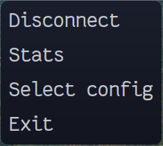
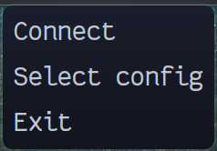

# openvpn3-applet (for Linux)

## Prerequisites:
* openvpn3-linux (https://github.com/OpenVPN/openvpn3-linux)
  * Debian/Ubuntu: https://openvpn.net/cloud-docs/openvpn-3-client-for-linux/#installation-for-debian-and-ubuntu
  * Arch: https://aur.archlinux.org/packages/openvpn3
  * Red Hat/Centos: https://openvpn.net/cloud-docs/openvpn-3-client-for-linux/#installation-for-fedora-red-hat-enterprise-linux-centos-or-scientific-linux
* yad (https://github.com/v1cont/yad)
  * Debian/Ubuntu: https://wiki.ubuntuusers.de/yad/
  * Arch: https://archlinux.org/packages/community/x86_64/yad/

## Install

- Download the script: `git clone https://github.com/nesto-software/openvpn3-applet.git /tmp/openvpn3-applet`
- Install the script: `cp -R /tmp/openvpn3-applet/src/. ~/.openvpn3-applet`
- Add to autostart: `cp /tmp/openvpn3-applet/xdg-config/autostart/openvpn3-applet.desktop ~/.config/autostart/`

Note: Your desktop environment must support [XDG Autostart](https://wiki.archlinux.org/title/XDG_Autostart) for this to work.

Alternatively, to start the applet manually, launch the script: `~/.openvpn3-applet/openvpn3applet.sh`.

## Autostart
If you run a Desktop Environment like KDE, add the bash script to "System Settings" -> "Startup and Shutdown" -> "Autostart" -> "Applications" (add).

## Preview

### Icon shows connection status
- red -> disconnected   
- green -> connected   
- blue -> connecting   

### Popup Menu to manage the connection when clicking on the icon

### Applet controls the openvpn3 binary which opens the browser for sso

## Author

`Caro <caroline.hemberger@nesto-software.de>`

License: MIT

## Contributors

- `Martin <martin.loeper@nesto-software.de>`
- Feel free to open an issue or PR if you have any proposal...